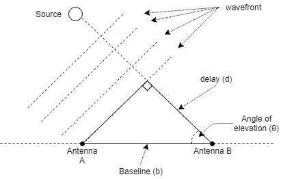

# Delay Tracking

The scripts in this folder determine some of the delay tracking requirements based on the placement of the MeerKAT 
extension antennas.

## Requirements

1. Python 3.6 or later
2. Install all python extensions in [requirements.txt](requirements.txt)

## Running The Script

The script can be run by using the following command: `python3.6 delay_tracking_requirements_calculator.py`

## Theory

A wavefront from a source is normally not parallel to the ground. This means that the wavefront reaches one antenna
before it reaches the other. In order to compare these two signals, this difference needs to be taken into account.
This process is know as Delay Compensation/Delay Tracking.

In order to calculate the delay, a right-angle triangle is formed where the hypotenuse is the length of the baseline 
(distance between antennas) and the second side is the wavefront. The third side is the delay. This is shown in the
diagram below:

In order to calculate the delay the following formula is used:

In meters: d(&theta;) = b cos(&theta;) (m)

In seconds: d(&theta;) = b cos(&theta;)/c (s) (c is the speed of light in a vacuum)

The result in seconds is more useful for our application, as such that will be used from here on out.

### Calculating Maximum Delay

The maximum delay occurs when the source is directly on the horizon: dmax = d(0) = b cos(0)/c = b/c  (s)

### Calculating rate of change of delay limits.

Rate of change of delay is measured in ns/s. It is the number of nano-seconds the delay changes per second. The model 
used to calculate this is that of a source moving across the sky at a uniform rate. In other words, over a 24 hour
period, a source will rotate by 360 degrees. The change in degrees per second is equal to 
`360 / (24 * 60 * 60)  = 0.004166` degrees/second.

The maximum rate of change occurs when the source is at an elevation of 90 degrees. The simplest estimate for this can
be found with the equation: `d(90 - 0.004166) - d(90)`

The minumum rate of change occurs when the source is closest to the horizon. For MeerKAT a source will be tracked up to
15 degrees elevation. The estimate for this change can be found with the equation: `d(15) - d(15 + 0.004166)`
