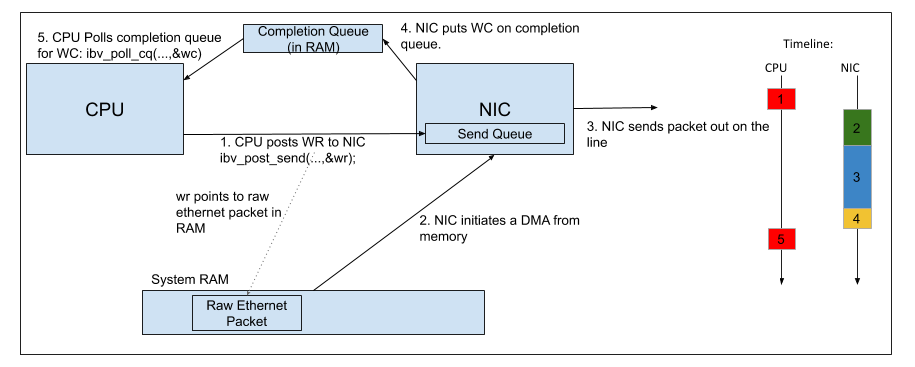
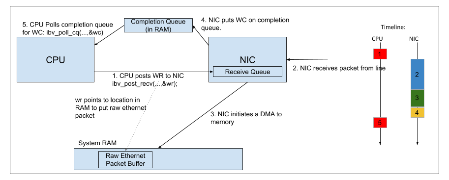

# Using the ibverbs library to accelerate NIC packet TX/RX on Ethernet Networks

## Quick Summary

This program uses ibverbs and a Mellanox ConnectX-5 100 GbE NIC to send and receive raw ethernet UDP packets at high 
data rates. 

ibverbs bypasses the linux kernel stack to directly DMA data from user memory to the NIC. This 
approach also requires very little CPU use. The CPU basically loads requests on a queue in the NIC and then 
polls a seperate queue to check when these requests are complete. All the heavy lifting is performed by the NIC and 
memory system.

Lossless TX and RX rates at 90 Gbps have been achieved when running this program.

## Terminology

There are a number of terms that come up around this topic. Our specific implementation makes use of the technology in a
way that is not immediatly clear from the terminology used. I have clarified the terms below: 

1. InfiniBand - Infiniband is an alternative to Ethernet for building a computer network. InfiniBand is an open standard 
that is primarily supported by Mellanox. 
2. RDMA - RDMA stands for Remote Direct Memory Access. This is a technology that allows one node on a network to 
exchange data with another node without involving either CPU. This lets nodes transfer data significantly faster
than the kernel networking stack allows. RDMA requires a compatible NIC to work. 
3. ibverbs - ibverbs(InfiniBand verbs) can be thought of as the API for facilitating RDMA transactions over Infiniband
networks.

The above three definitions generally refer to the standard way this technology is used. Our implementation differs 
from the standard RDMA flow. Instead of performing RDMA transactions over Infiniband, we are sending and 
receiving standard UDP packets over ethernet in what is sometimes referred to as "Raw Ethernet Programming". The RDMA
enabled NICS support this, while the ibverbs library has been extended to support ethernet and raw 
packet programming. We are not using InfiniBand or RDMA even though those names are in the tools we are using.

When researching this topic online, it is far more likely that you will come across articles talking about the standard
RDMA implementation as "Raw Ethernet Programming" is not well documented.

## Recommended Reading

I have put together a list of relevant resources that I was able to find that I think are useful for understanding the 
topic. 

1. Mellanox has a free course entitled: 
[The Fundamentals of RDMA Programming](https://academy.mellanox.com/en/course/rdma-programming-intro/?cm=446). It should
take about 3 hours to complete and explains the core concepts and terminology behind RDMA and ibverbs. It does 
not go into Raw Ethernet Programming.  

2. Documentation for most of the iberbs functions can be found in the
[RDMA Aware Programming User Manual](https://www.mellanox.com/related-docs/prod_software/RDMA_Aware_Programming_user_manual.pdf)
. This guide only gives examples for standard RDMA programming and does not mention any of the functions required 
specifically for Raw Ethernet Programming. It is a useful reference when it comes to function descriptions and 
terminology.

3. The example that this repo was based on can be found 
[here](https://community.mellanox.com/s/article/raw-ethernet-programming--basic-introduction---code-example). 
This is the only example of Raw Ethernet Programming I was able to find online. I have gone through it and modified it 
to get maximum performance. Furthermore I have commented and clarified aspects of it that were initially unclear to me. 

4. To receive raw UDP data, the NIC needs to be given steering rules(or flows) so that it knows which received packets 
must be directed to ibverbs and which must be directed to the kernel. This functionality is not well documented. This 
repo attempts to give a decent example of how to create a steering rule. The 
[Man Page](https://man7.org/linux/man-pages/man3/ibv_create_flow.3.html) for the function that creates these flow rules
is the most useful online resource I could find.

5. I tested this on a Mellanox card running the Mellanox OFED drivers. This is all documented in the 
[Mellanox OFED Manual](https://docs.mellanox.com/display/MLNXOFEDv461000/Ethernet+Network). This is useful for seeing 
all the supported features(such as checksum offload mentioned below) as well as for describing advanced options for 
your NIC. While not too useful for this example, some of these features are helpful for more advanced 
systems. An example is that for MeerKAT we disable multicast loopback on our NICs.

6. In this example, the UDP checksum is not calculated as it is quite an expensive operation. MeerKAT does not check UDP
checksums. If this is important to you, Mellanox OFED version 5.0 and above support offloading the checksum calculations 
to the NIC. I have not tested this. Look at the IBV_SEND_IP_CSUM in 
[this](https://manpages.debian.org/testing/libibverbs-dev/ibv_post_send.3.en.html) man page to find out more on this.

## Compiling and running the example

### Test System Configuration 

This was run with the following installed:
1. Ubuntu 18.04
2. MLNX_OFED version 4.6
3. A single port ConnectX-5 Mellanox NIC connected to an SN3800 switch.

### Installing

Running `make` should compile the program.

### Configuring

Raw Ethernet programming requires that the network packet headers be filled in by the user. For simplicity, I have kept 
these values hard coded. The user will need to modify them to match their particular network setup. 

In `ibverbs_tx.c` the `DESTINATION_IP_ADDRESS`, `DESTINATION_MAC_ADDRESS`, `SOURCE_IP_ADDRESS` and `SOURCE_MAC_ADDRESS`
macros need to be modified.

In `ibverbs_rx.c` the `SOURCE_IP_ADDRESS` and `DESTINATION_IP_ADDRESS` macros need to be modified.

It is quite straight forward to determine IP addresses. MAC addresses are slightly trickier. On our servers running
`arp` gives us the arp table showing the different mac addresses and IP addresses they are linked to. 
__NOTE:__ If you are on a L2 switch, your destination MAC address and IP address should belong to the same interface and
be the same entry in your ARP table. If you are using a router/L3 switch the destination MAC address would need to be 
that of the router between the source and destination servers. I have only tested this software on a L2 switch.

### Running

You need to run these commands as sudo. If you do not, you will likely get a "Couldn't create RSS QP." error.

To start transmitting: `sudo ./ibverbs_tx`

To start receiving: `sudo ./ibverbs_rx`

I have not tested this in loopback mode - I have one node transmitting while another seperate node receives.

## Relevant Theory

The Linux kernel networking stack is rather slow and clunky, it requires context switches and a redundant memory 
transfer from user space memory to kernel space memory. It is not able to keep up at data rates above 10 Gbps.

There are a number of different alternatives to the standard networking stack. These include DPDK, io_uring and ibverbs.
This project only deals with ibverbs.

The core idea behind the ibverbs tools is to offload as much of the work from the CPU to the NIC. ibverbs enables this 
with two key concepts:

1. Lightweight non-blocking message passing between the NIC and the CPU - In the ibverbs paradigm, the CPU controls the 
NIC by sending it small messages called Work Requests(WR). The WR can either initiate a UDP packet send or tell the NIC 
where to store a packet that has been received. Once the WR has been sent, the CPU is free to work on other tasks, the 
NIC handles the WR on its own. Once the NIC completes the send or receives a packet, it informs the CPU that the 
operation is complete by sending a small message called a Work Completion(WC) to the CPU. When the CPU receives this WC,
it knows that the NIC has completed its task. These WR and WC message sending mechanisms are asynchronous and 
non-blocking. The NIC/CPU does not need to wait for the other device to process the message. These messages are instead 
put on a queue. A WR gets put on the NIC's send queue or receive queue (depending on whether the WR deals with 
sending or receiving packets.). A WC gets put on a Completion Queue(CQ) in system RAM. The CPU can then poll this queue
to check if a WC has been sent by the NIC.

2. NIC initiated DMA of user space memory - A standard c `memcpy ` is a blocking operation. By offloading these memory
copies directly to the NIC, the CPU is freed up to perform other tasks. This significantly reduces the load on the CPU.
Furthermore, this copy takes place directly from user space memory to the NIC, an intermediary copy from the user
memory to kernel kernel memory is not required. This reduces the load on the memory bus. A WR sent from the CPU to the 
NIC will contain a pointer to the location in user memory to store a packet when it is received (in the case of a 
receive WR) or tell the NIC where in user memory the raw packet to be sent is located (in the case of a send WR).

We are sending and receiving raw ethernet packets. This means that what is received is not just the UPD
payload, it also includes all UDP, IP and Ethernet headers. When transmitting all packets, the user needs to populate
these headers correctly. This sample program has attempted to do that - the user is just required to configure IP and 
MAC addresses correctly.

The image below shows the general flow for sending UDP data with ibverbs.

The image below shows the general flow for receiving UDP data with ibverbs.

__NOTE__: This program continously polls the CQ to determine when a WC has been received. As such it looks like the CPU 
is always at 100% utilisation. I think the polling can be replaced with an interrupt but I have not looked too deeply
into this.
