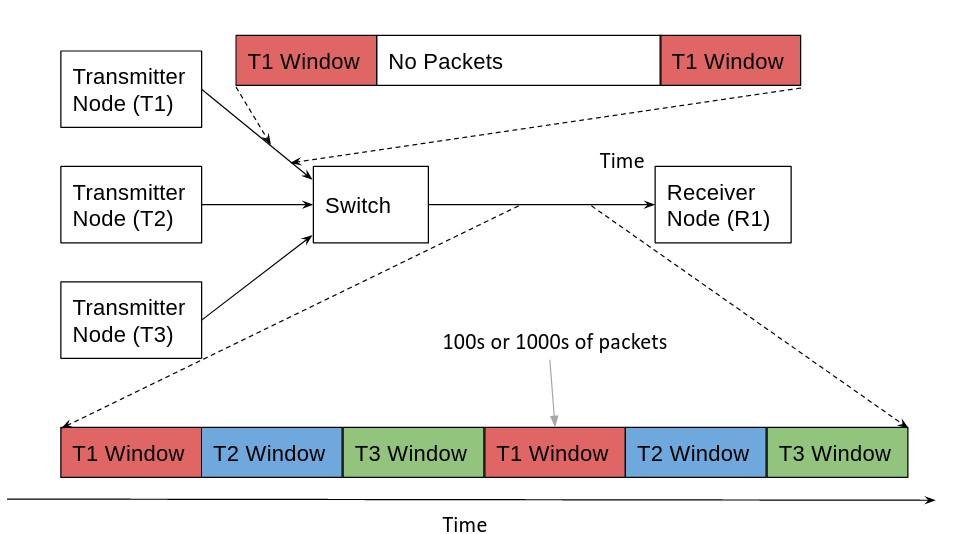

# Introduction

This utility implements a form of time division multiplexing that allows for multiple senders to transmit data
to a single receiver at full line rate over an ethernet network. This time division multiplexing prevents two senders 
from transmitting at the same time and overloading the link. 

In its current form, the utility does not transfer at the require full 100 Gbps data rate, the 
main focus of the utility is to test and evaluate the time division multiplexing part of the algorithm. 

Each sender is assigned specific time slots called windows. These windows are all interleaved in time. The user can 
specify dead time between windows where no data is transmitted.

The diagram below attempts to show the time division multiplexing and system structure.

Some network and system configuration needs to be done to make this system work reliably. This is detailed in the
Maximising Performance section below.

A number of matlab scripts are contained in this repository for visualising the results produced by the 
utility.

# Installation

This utility is written in C and does not require any non-standard packages. 

This utility can be installed by typing `make`. Two seperate files are created. One called `udp_send` to be used at the 
transmitter and the other called `udp_receive` to be used at the receiver.

In its current form, the user has to hard code the receiver ip address. This can be done by modifying the 
`#define SERVER_ADDRESS 10.100.18.14"` line in the upd_send.c file. This will be made a command line parameter if this 
code is ever revisited.

# Using the Utility

In order to use this utlility, a number of nodes in the same network are required. A transmitter can be run simply by 
typing `./udp_send` in the terminal. The transmitter will get all configuration parameters from the receiver. Running
the `./repeat_send.sh` script will call `udp_send` infinitly so that it is ready to perform another test when the 
current test completes. 

The user specifies all configuration parameters in the receiver. The receiver has a few default parameters. Running 
`./udp_receive` on its own will use default parameters. Running `./udp_receive -h` will provide a list of the different 
command line parameters. 

The default output mode will output data on a per packet basis. The 
`jitter_and_delay_characterisation.m`, `packet_overlap_and_deadtime.m` and `visual_overlap.m` scripts provide
information on data output in the per packet format.

Running `./udp_receive` with the `-c` flag will output per window statistics. This is more suitable for longer tests
where packet level information produces impractically large data files. The `per_window_plots.m` file takes in data
produced in the per window format and produces useful plots.

All the matlab plots have the file name hardcoded in the script. This will need to be changed when a new file is
generated by `udp_receive`

The `deadtime_test.sh` and `timed_stress_test.sh` do not produce useful results at the moment and should be ignored.

# Maximising Performance

Maximising performance on a NIC is a broad topic. The list below is not exhaustive. There may be other ways to improve
performance.

## Quick Summary

This describes the minimum required to run the transmitters and receivers optimally. The details for each can be found
in the sections below.

For all transmitters and receivers:
1. Put the nodes into a PTP pool as described the the Timing section below.
2. Disable low power C-states in the bios.
3. Ensure libvma is installed correctly as described in the libvma section below.
4. Run: `ethtool -G <interface_name> rx 8192 tx 8192`

Additional commands to run on the receiver:
1. Run: `sudo ethtool -C <interface_name> adaptive-rx off rx-usecs 0 rx-frames 0` 

Additional commands to run on the transmitter:
1. Run: `sudo ethtool -C <interface_name> adaptive-tx off tx-usecs 16 tx-frames 16`

To actually run the program the following commands must be executed:
1. Receiver: `sudo LD_PRELOAD=libvma.so VMA-SELECT-POLL=-1 VMA_THREAD_MODE=0 VMA_SPEC=latency chrt 50 numactl 
-N 0 -m 0 ./udp_receive -t 1 -n 100 -d 500 -w 100000 -o NetworkTestOutputFile`
2. Transmitter: `sudo chrt 50 numactl -m 0 -N 0 ./udp_send`

## Useful Network Monitoring Commands
1. ethtool
    1. `sudo ethtool -c <interface_name>` - View interrupt coalescing settings.
    2. `sudo ethtool -a <interface_name>` - Determine if link flow control is enabled.
    3. `sudo ethtool -g <interface_name>` - View network buffer sizes.
    4. `sudo ethtool -S <interface_name>` - View all NIC counters. Including TX/RX counters.
2. `sudo netstat -neopa` - Display all process to socket/ip/port mappings.
3. netstat
    1. `netstat -su` - Display all protocol specific counters. Does not seperate by interface.
    2. `netstat -i` - Abridged display showing a few basic counters for each interface, including tx/rx packets 
    recieved and tx/rx errors.

## Ethtool NIC configuration commands

The following commands were used to configure the interface being used for the network tests:

1. `ethtool -G <interface_name> rx 8192 tx 8192` - Set network buffer sizes to prevent packets getting dropped due to 
    buffer overflow. 8192 bytes is the maximum size on most current NICs.
2. `sudo ethtool -C <interface_name> adaptive-tx off tx-usecs 16 tx-frames 16` - Set interrupt coalescing for TX 
    parameters. Setting both usecs and frames to 16 seems to be the optimal setup on dbelab07. 
3. `sudo ethtool -C <interface_name> adaptive-rx off rx-usecs 0 rx-frames 0` - Set interrupt coalescing for RX 
    parameters. Setting receiver side rx-usecs and rx-frames to zero has resulted in the least packets being dropped by 
    the receiver. This is specifically in the 10 Gbps domain. It is suspected that this may not hold up at the 100 Gbps 
    rates.

Here is a [link](https://access.redhat.com/sites/default/files/attachments/20150325_network_performance_tuning.pdf) to
a useful guide on tuning network performance. It provides details the reasons for most of the above commands.

## Processor C-states
Modern processor can be in different modes known as C-states. The C-states reduce the CPU power consumption by putting 
the CPU in hibernation mode. Waking up to service a received packet can results in packet drops. C0 is indicates the 
CPU runs at maximum performance and power with higher numbers indicating that the CPU spends more time hibernating. 

The following are useful commands when looking at C-states:
1. `cat /sys/module/intel_idle/parameters/max_cstate` - View the maximum system c-state.
2. `sudo powertop` - Detailed system power consumption and C-state levels can be monitored using the 
[powertop](https://01.org/powertop) utility.

C-states can be disabled in system bios or by modifying some grub utilities. C-states have not yet been disabled but 
a reduction in performance when a stream first starts transmitting has been observed - this has been attributed to 
the CPU switching from low power to high power C-states.

## NUMA Boundaries

Modern servers often have multiple NUMA domains. Care must be taken to ensure that data destined for the NIC is not
allocated across a number of domains as this decrease performance. The numactl linux utility can be used to bind the 
program to a single NUMA domain: `numactl -N 0 -m 0 ./udp_receive`. This must be done on both the sender and receiver
side.

When using Mellanox NICs, run the `sudo mst status -v`  command to see which NUMA node the NIC maps to.

**NOTE** When I use `numactl -C 4 -m 0 ./udp_receive` (-C instead of -N), to bind the receiver to a specifc CPU core,
I observe a slight decrease in performance. This is not a general trend and different systems will behave differently.

## Process Priority
By default the network threads are launched with the same priority. The network threads need to be more responsive to 
ensure maximum rates are achieved at the transmitter and no packets are dropped at the receiver. Increasing the priority
of these threads ensures that they remain running at all times and are not preempted.

The first attempt to increase process priority was to use the `nice` command:

`sudo nice -n -5 ./udp_send` (lower value is higher priority)

However `nice` only modifies userspace priorities. It turns out that Linux has moderate support for soft real time 
applications. The `chrt` utility allows real time priorities to be assigned to processors that have higher priority 
than any userspace and most kernelspace programs:

`sudo chrt 50 ./udp_send` (Higher value is higher priority)

## Timing 
In order to transmit packets at precise time intervals, all nodes on the network need to agree on what the time is.

By default, Ubuntu uses NTP to synchronise network tests. Ubuntu syncs times to a few global servers. This can lead to 
the different servers being out of sync by a few milliseconds. This is uncomfortably high. To improve this, the nodes
can be configured to synchronise to a local NTP server. The instructions to do this are described in point 1 below.

Even using a local NTP server, times can be out by a few milliseconds. The PTP protocol achieves synchronisation within 
a few tens of microseconds. All nodes can be put in a PTP pool and they negotiate a master node and all sync to that 
node. The results from using PTP have been very promising. The steps to do this are described in point 2 below.

1. ### NTP 
    1. Install NTP if it is not installed : `sudo apt-get install ntp`.
    2. View the ntp servers that are connected: `ntpq -p`. The ip address with the "*" next to it is the one that the 
    server is using to set its time.
    3. Go to the ntp configuration `/etc/ntp.conf` file and add the following line: `server ntp.kat.ac.za iburst`. This 
    line adds the local ntp server to the list of available servers. Removing the other servers will force your server 
    to sync to that one server.
    4. Restart the ntp server: `sudo service ntp restart`. Run `ntpq -p` to confirm that the server now appears in the 
list of available NTP servers and that it has a "*" next to it indicating the time.

2. ### PTP 
    1. In order for ptp to work correctly, the ntp service needs to be stopped: `sudo service ntp stop`.
    2. Install and configure ptp according to SDPs [Ansible scripts](https://github.com/ska-sa/katsdpinfrastructure/blob/master/ansible/roles/datetime/tasks/ptp.yml)
        1. Install PTP - `sudo apt-get install ptpd`
        2. Create a directory `/var/log/ptp` to log ptp information information. Set permissions to 0755
        3. Overwrite the contents of `/etc/default/ptpd` file with the following 
        [file](https://github.com/ska-sa/katsdpinfrastructure/blob/master/ansible/roles/datetime/files/etc_default_ptpd) 
        from SPD.
        4. Create the file `/etc/ptpd.conf` with permissions 0644. Copy the configuration information from the SDP 
        ansible repo(found 
        [here](https://github.com/ska-sa/katsdpinfrastructure/blob/master/ansible/roles/datetime/templates/ptpd_conf.j2)). 
        5. In `/etc/ptpd.conf`, replace the `{{ ansible_default_ipv4.interface }}` command with the systems interface name. 
        6. In `/etc/ptpd.conf`, remove the ``, `` and `` Ansible 
        commands as well as the `ptpengine:preset=slaveonly` and `ptpengine:ntp_failover=n` between the `` and
        `` commands. This will put all ptp servers into a single pool.
        7. In `/etc/ptpd.conf` put the interface that all the ptp node will communicate over in the line 
        `ptpengine:interface=`
        8. Start the ptp service: `sudo service ptpd restart`. Simply running `sudo service ptpd start` did not start 
        the service correctly - only restart seems to work.
        
By tailing the log file `tail -f /var/log/ptp/ptpd.log` on the all the ptp servers in the pool, you should be able to 
see the nodes select a master and send their first synchronisation messages to each other. 

In the log directory the file `/var/log/ptp/status` for each slave will report on how in sync it is with the master.
An offset of a few microseconds is expected.

**NOTE:** This configuration keeps all PTP servers in a pool and in sync with each other, however they will drift from 
global time. This is acceptable for the purposes of the timing tests as the nodes in the pool only need to be in sync 
with each other.

## Libvma
Mellanox provides a library called VMA that accelerates the performance of standard socket applications. This is done 
transparently. The user creates ordinary sockets and the vma tools will bypass the standard(slow) kernel and network 
stack, instead implementing the functionality in the userspace using the mellanox verbs api. The full guide can be 
found [here](https://www.mellanox.com/related-docs/prod_acceleration_software/VMA_8_6_10_User_Manual.pdf).

Libvma is relativly simple to use. To implement it:
1. Ensure libvma is is installed. Refer to the 
[installation guide](https://www.mellanox.com/related-docs/prod_acceleration_software/VMA_8_6_10_Installation_Guide.pdf)
.
2. Launch the command line utilities prefaced with "LD_PRELOAD=libvma.so", eg: 
`LD_PRELOAD=libvma.so ./udp_send`

On the udp_send side using `LD_PRELOAD=libvma.so` made a version of the sender go from transmitting at a data rate of 
~12Gbps to a data rate of ~41 Gbps. This occured without modifying any of the source code. By using  
`LD_PRELOAD=libvma.so ./udp_receive`, the receiver also dropped significantly fewer packets. Using this mode, 0 packets
were dropped at the 12 Gbps data rate while 60% of packets were dropped at the 41 Gbps data rate. The network timing 
tests do note require data to be transmitted at full line rate, as such libvma was enabled on the receiver not the 
sender to ensure the most packets were received and analysed.

Additional VMA configuration can be given as arguments after the `LD_PRELOAD` command: \
`LD_PRELOAD=libvma.so VMA-SELECT-POLL=-1 VMA_THREAD_MODE=0 ./udp_receive` \
Additional configuration opetions are specified in the vma user guide as well as a
[VMA Performance Tuning Guide](https://community.mellanox.com/s/article/vma-performance-tuning-guide) on the Mellanox 
website.

Libvma improves performance so significantly on the receiver at 12 Gbps that the `numactl` and `chrt` commands become 
unnecessary on smaller tests. The overnight tests have not been run without `numactl` or `chrt`, so the long term 
stability without these commands is unknown. 